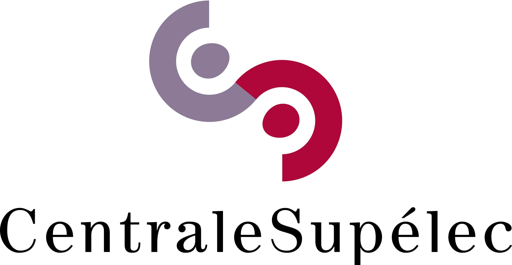

# Courses, Assignments, Lecture Notes Repository

  
  

## Description

This repository contains LaTeX files related to various courses. The content is organized into three main categories:

- **Assignments**: Coursework and problem sets completed during the semester.
- **Project Reports**: Detailed reports on projects carried out as part of course requirements.
- **Notes**: Personal notes taken during lectures or study sessions.

There is also a collection of compiled PDFs located in the folder `Examples of PDF`, providing a condensed version of some of the documents.

Feel free to explore and use the LaTeX files as a resource or reference for your own work.
